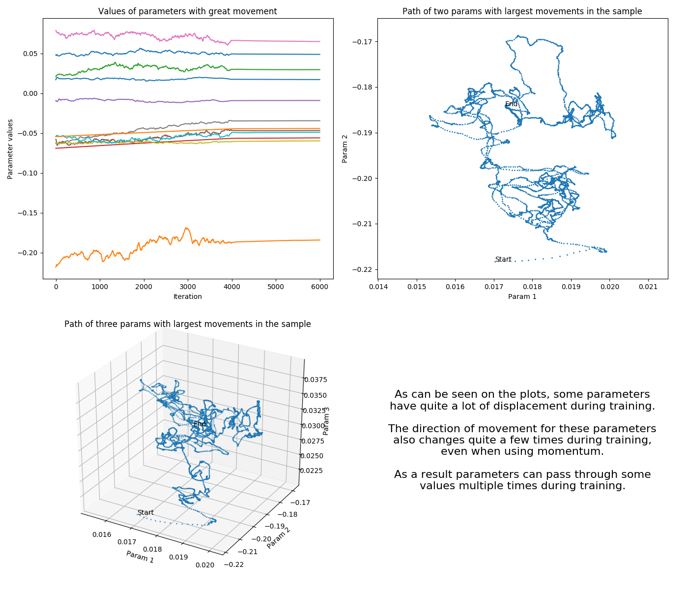

# Purpose
Investigate how ML parameters change during training.

# Motivation
Deep learning model optimization is said non-convex,
I wanted to visualise how much non-convex it is.

# Results
Results which are produced using `plot_train.py`, can be seen below.

Running `plot_train.py` will also show the same figure with 3d plot being interactive.